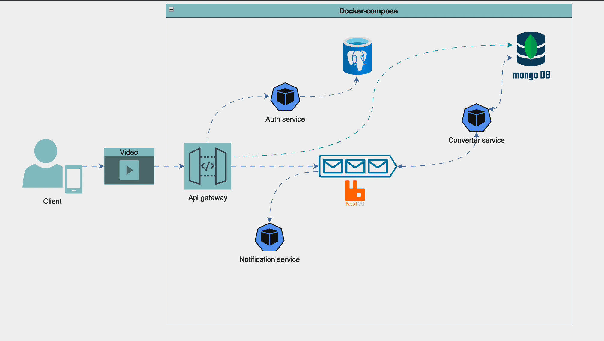

# Video to MP3 Converter Microservices

## Overview

This project consists of a set of microservices that enable users to upload video files, convert them to MP3 format, and manage their files through a web API. 
The architecture utilizes `MongoDB` for storage, `RabbitMQ` for messaging, `PostgreSQL` for relational data storage, and `Flask` for the web server. The main components are:

- **Gateway Service**: The entry point for user interactions, handling login, file uploads, and downloads.
- **Converter Service**: Consumes messages from a `RabbitMQ` queue to convert video files to MP3.
- **Authentication Service**: Manages user authentication and token validation.
- **Storage Service**: Handles file storage using `MongoDB`'s GridFS.
- **Notification Service**: Notifies users when a new MP3 file is available.

## Architecture Diagram

  <!-- Add your architecture diagram here -->

## Prerequisites

Before running the services, ensure you have the following installed:

- [Docker](https://www.docker.com/get-started)
- [Docker Compose](https://docs.docker.com/compose/install/)

## Services

### 1. Gateway Service

- **Endpoint for Login**: `/login`
- **Endpoint for Upload**: `/upload`
- **Endpoint for Download**: `/download`

### 2. Converter Service

- Consumes messages from the RabbitMQ `VIDEO_QUEUE` and converts video files to MP3.

### 3. Authentication Service

- Provides endpoints for user login and token validation.

### 4. Storage Service

- Uses MongoDB to store video and MP3 files.

### 5. Notification Service

- Consumes messages from the `MP3_QUEUE` and notifies users when a new MP3 file is available.

## Getting Started

### Environment Variables

Make sure to set the following environment variables in your `.env` file:

```plaintext
MONGO_USER=<your_mongo_user>
MONGO_PASSWORD=<your_mongo_password>
MONGO_HOST=<your_mongo_host>
RABBITMQ_HOST=<your_rabbitmq_host>
AUTH_SVC_ADDRESS=<your_auth_service_address>
VIDEO_QUEUE=<your_video_queue_name>
MP3_QUEUE=<your_mp3_queue_name>
POSTGRES_USER=<your_postgres_user>
POSTGRES_PASSWORD=<your_postgres_password>
POSTGRES_DB=<your_postgres_db>
POSTGRES_HOST=<your_postgres_host>
```

### Running the Services

Each service has its own Dockerfile and requirements file. The next section will guide you through creating a `docker-compose.yml` file to run all the services together, including their dependencies (`RabbitMQ`, `MongoDB`, and `PostgreSQL`).

## Missions

### Mission 1: Create a Docker Compose File

Create a `docker-compose.yml` file that includes the following services:

- **Gateway Service**
- **Converter Service**
- **Authentication Service**
- **Storage Service**
- **Notification Service**
- **RabbitMQ** (use the official RabbitMQ image `rabbitmq:3-management`)
- **MongoDB** (use the official MongoDB image - `mongo:latest`)
- **PostgreSQL** (use the official PostgreSQL image - `postgres:14`)

Your `docker-compose.yml` should allow you to run all services and their dependencies with a single command - make sure to have the ability to rebuild each service on a code change:

```bash
docker-compose up -d --build
```

### Mission 2: Create a Notification Service

Develop a new service called **Notification Service** that will:

- Consume messages from the `MP3_QUEUE`.
- Notify users when a new MP3 file is available, using the username from the message.

You can choose any notification method you prefer, such as sending an email, using a messaging service (e.g., Slack, Telegram), or logging to the console.

## Testing the Services

After starting the services, you can use tools like Postman or CURL to interact with the Gateway Service endpoints for uploading videos and downloading MP3s.

## Conclusion

This project provides a solid foundation for understanding microservices architecture, asynchronous processing with RabbitMQ, and file handling with MongoDB. Completing the missions will help you deepen your knowledge and practical skills in deploying and managing microservices.


curl -X POST http://localhost:8080/login -u tompaz@email.com:Admin123
curl -X POST -F 'file=@./test.mp4' http://localhost:8080/upload -H 'Authorization: sdvlkjhdsov'